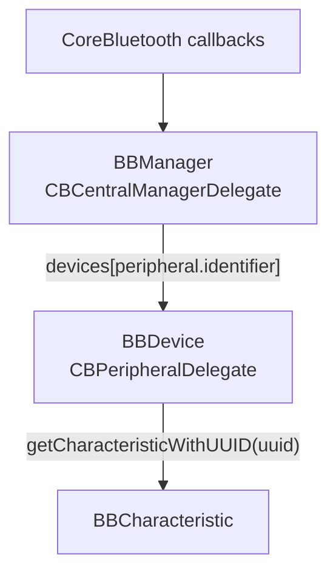
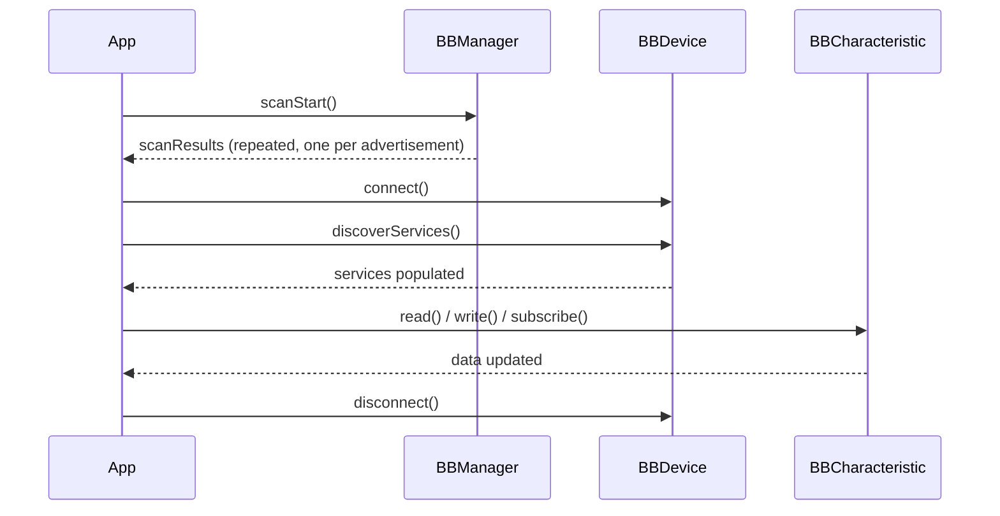
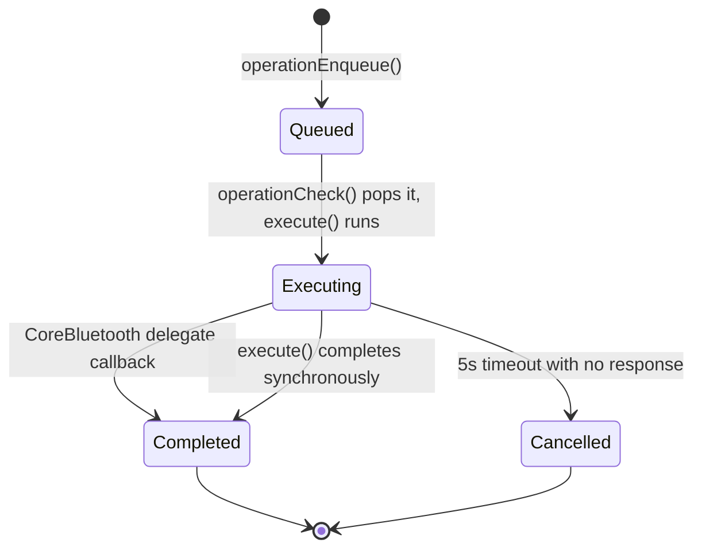

# Architecture

This document explains how BlueBreeze is put together internally: the core types, the
scan/connect/discover/read-write-notify flow, and the per-device operation queue that serializes
BLE requests. It's aimed at anyone modifying BlueBreeze itself, or who wants to understand its
behavior beyond what the [API docs](README.md#documentation) describe for a single call.

## Core types

| Type | Role |
|---|---|
| `BBManager` | Owns the single `CBCentralManager`. Entry point: authorization, adapter power state, scanning, and the discovered `devices` dictionary. |
| `BBDevice` | One peripheral. Owns its `CBPeripheral`, connection state, discovered `services`, and its own operation queue. |
| `BBCharacteristic` | One characteristic of a discovered service. Exposes `data`/`isNotifying` and the read/write/subscribe operations. |
| `BBScanResult` | One advertisement packet, decoded, delivered via `BBManager.scanResults`. |
| `BBOperation` / `BBOperationImpl` | Protocol and base class for a single queued BLE request (connect, read, write, ...). Each concrete operation lives in `Operations/`. |

`BBManager` is the only object that talks to CoreBluetooth's delegate protocols directly for
`CBCentralManager`-level events; it forwards each callback to the `BBDevice` it concerns by
looking it up in `devices` by `CBPeripheral.identifier`. Each `BBDevice` in turn is its own
`CBPeripheralDelegate` and forwards characteristic-level callbacks to the right `BBCharacteristic`.

## The scan -> connect -> discover -> operate flow

A few things that aren't obvious from the type signatures alone:

- **`scanResults` fires repeatedly per device.** Every advertisement packet produces a
  `BBScanResult`, not just the first sighting of a peripheral. Use `BBManager.devices` if you only
  want the deduplicated set of discovered peripherals.
- **`services` populates in two stages.** A service key appears with an empty characteristics
  array as soon as it's discovered, then fills in once characteristic discovery for that service
  completes -- both happen inside the single `discoverServices()` call, so by the time it returns,
  `services` is fully populated.
- **Nothing is automatic across these steps.** Connecting doesn't discover services, and
  discovering services doesn't subscribe to anything -- each step is an explicit, separate
  `await`.

## The operation queue

Every BLE request (connect, disconnect, discover services, negotiate MTU, and each
characteristic's read/write/subscribe/unsubscribe) is modeled as a `BBOperation` and run through
`BBDevice`'s operation queue rather than calling CoreBluetooth directly. This exists because
CoreBluetooth only supports one in-flight request per peripheral at a time -- without a queue,
overlapping calls (e.g. two reads fired without awaiting the first) would step on each other.

How it works, in `BBDevice.swift`:

1. **`operationEnqueue(_:)`** wraps the call in `withCheckedThrowingContinuation`, appends the
   operation to `operationQueue`, and calls `operationCheck()`.
2. **`operationCheck()`** is the only place that starts an operation. It pops the next operation
   off the queue *only if* the current one has already completed, calls its `execute(_:)`, and
   schedules a 5 second timeout. If `execute(_:)` completed the operation synchronously (e.g. a
   write without response, which doesn't wait for a peripheral acknowledgment), it recurses
   immediately instead of waiting for the timeout to notice.
3. **Completion** happens one of two ways: a CoreBluetooth delegate callback resolves the
   operation's continuation (`completeSuccess`/`completeError`), or the timeout fires and cancels
   it. Either path calls `operationCheck()` afterward so the next queued operation starts
   immediately rather than waiting for something else to trigger it.
4. **`operationLock`** (an `NSLock`, wrapped by the `withOperationLock` helper) guards every read
   or mutation of `operationCurrent`/`operationQueue`, and wraps both the timeout's
   check-and-cancel and each delegate-forwarding call. This is what prevents a peripheral response
   arriving at the same moment as a timeout from resuming the same `CheckedContinuation` twice
   (which would otherwise crash).

You don't interact with any of this directly -- it's why every public operation on `BBDevice` and
`BBCharacteristic` is a plain `async throws` call. Queuing, timeouts, and thread-safety are handled
for you.

## Threading

`BBManager` creates its `CBCentralManager` with a dedicated background `DispatchQueue`
(`centralManagerQueue`), so **every CoreBluetooth delegate callback -- and therefore every Combine
publisher update driven by one -- fires off the main thread.** If you're updating UI from any of
BlueBreeze's publishers, add `.receive(on: DispatchQueue.main)` before your `sink`.

## Where to look

- `BBManager.swift` -- adapter state, authorization, scanning, and the top-level CoreBluetooth
  delegate that routes callbacks to devices.
- `BBDevice.swift` -- per-device connection state, service discovery, and the operation queue
  described above.
- `BBCharacteristic.swift` -- per-characteristic data/notification state and operations.
- `Operations/` -- one file per `BBOperation` (connect, disconnect, discover services, negotiate
  MTU, read, write, notifications). `BBOperationImpl.swift` is the shared base class.
- `BBScanResult.swift` / `BBAssignedNumbers.swift` -- advertisement data decoding and the bundled
  Bluetooth SIG assigned-numbers lookup tables (regenerated by `Tools/fetch_known_uuids.py`).
